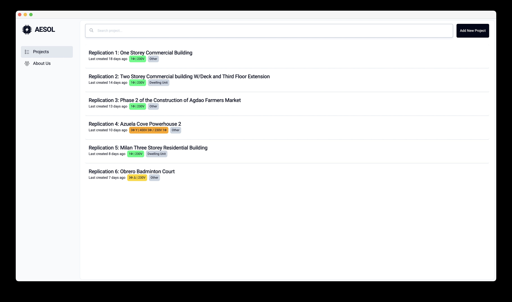
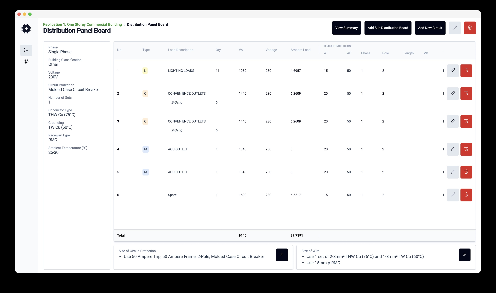
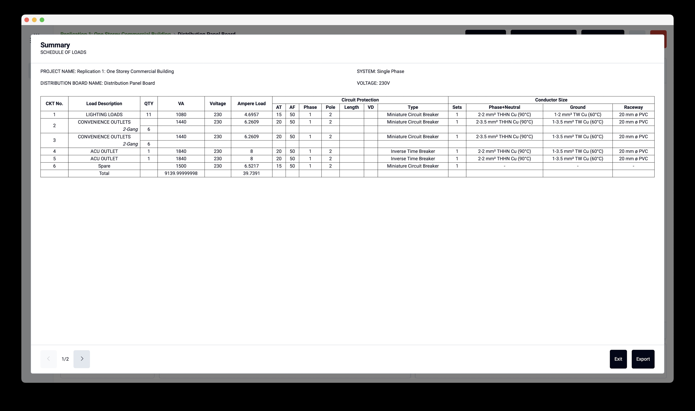
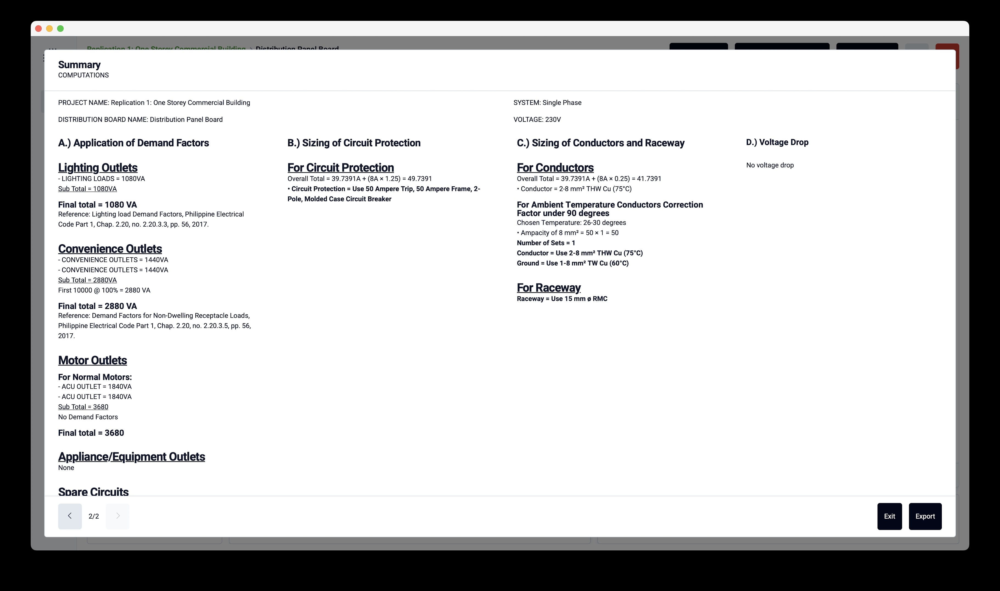
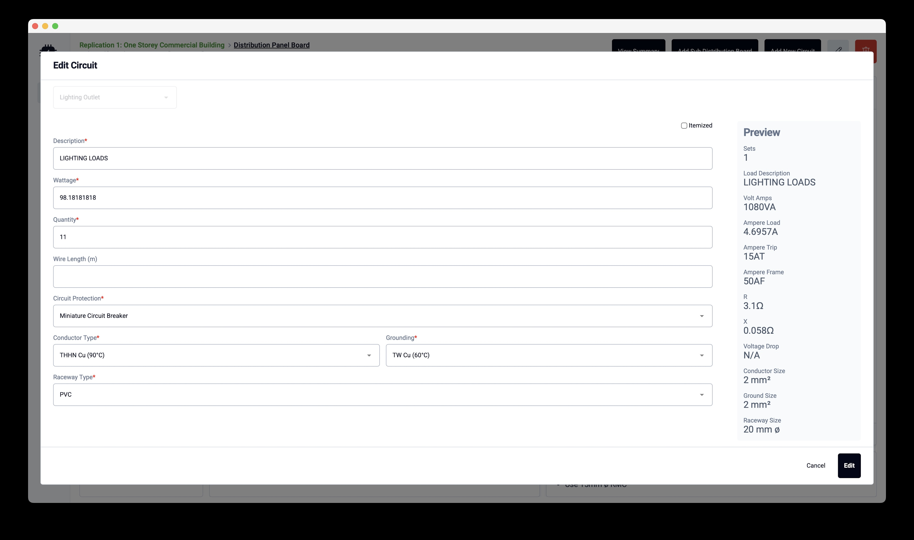

# Automated Electrical Schedule of Loads

Simplifies the process of creating an electrical schedule of loads based on the 2017 Philippine Electrical Code. Can be run in MacOS and Windows.

 
 

## Features Supported

### Data Types
**Circuit Types**
- Lighting
- Convenience
- Motor
- Appliance/Equipment
  - 
- Spare
- Space

**Distribution Boards**
- Single phase
- Three-phase WYE
- Three-phase delta

****

### Utilities
- Exporting data to Excel
- Three-phase load balancing
- Voltage drop correction
- Distribution board display of computations
- Distribution board specs suggestions
- Information area for each calculated value displayed in the table